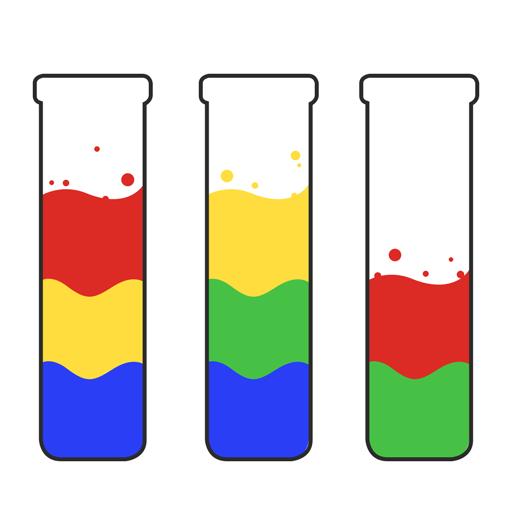
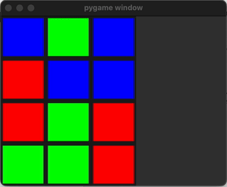

# WaterSortPuzzle

A creation of [Brandon](https://www.linkedin.com/in/brandonchiu12/), [Isa](https://www.linkedin.com/in/isa-bin-mohamed-yamin-71a12018b/) and [Thiru](https://www.linkedin.com/in/jayakumar-thirunithiyan-6778461b4/).

The Water Sort Puzzle involves sorting colored liquids into designated tubes. We used Pygame to create a visual and interactive environment for this puzzle. Our backend logic is powered by Python, which handles game state management, move generation, and solution evaluation. The program first creates a randomized puzzle that is displayed on our GUI. It then runs through 7 search algorithm to solve it while simultaneously printing out each movesets, as well as counting how many total moves was needed to solve it. Finally it prints the end result out and identifies which search algorithm is the most efficient in solving this. A Pygame interface pops out upon running the program that shows an animation of the AI solving the game using the optimal path.

# Caveats

The goal state is defined to be the first three test tubes on the left. Therefore, it is not optimal if the goal state is defined as *any* three test tubes filled fully with the same color -- which is the case in the actual game.

# What you should see

